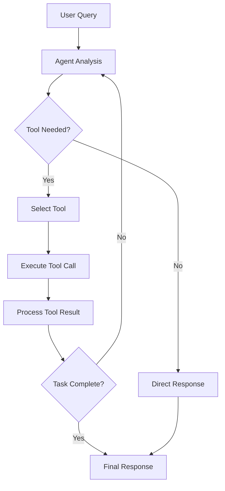

# Tool-Using Agent Pattern

**Problem**: Agents need to interact with external systems, APIs, and data sources to perform real-world tasks.

**Solution**: Equip agents with a standardized interface to call external tools based on task requirements.

## Overview

The Tool-Using Agent pattern enables AI agents to extend their capabilities by using external tools. Instead of being limited to text generation, the agent can:

- Perform mathematical calculations
- Search the web for information
- Read and write files
- Execute system commands (with proper security measures)

## Implementation

The implementation consists of:

- `tool_agent.py` - Main agent implementation using LangGraph
- `tools.py` - Tool definitions (Calculator, WebSearch, FileOperations)
- `test_tool_agent.py` - Comprehensive test suite
- `example.py` - Example usage script
- `requirements.txt` - Dependencies

## Tools Available

### Calculator
- Performs mathematical calculations
- Supports basic arithmetic operations (+, -, *, /, parentheses)
- Includes security measures to prevent code injection
- Validates input to only allow safe mathematical expressions

### Web Search
- Searches the web using DuckDuckGo's API
- Returns relevant information for queries
- Handles various response formats (Answer, AbstractText, Definition)
- Includes error handling for network issues

### File Operations
- **Write**: Create files with specified content
- **Read**: Read file contents
- **List**: List files in current directory
- Basic file management operations with error handling

## Usage

### Basic Usage

```python
from tool_agent import ToolUsingAgent

# Initialize the agent
agent = ToolUsingAgent()

# Mathematical calculations
response = agent.run("What is 25 * 17?")
print(response)

# Web search
response = agent.run("Search for information about LangGraph")
print(response)

# File operations
response = agent.run("Write 'Hello World' to a file called greeting.txt")
print(response)

# Complex multi-tool tasks
response = agent.run("Calculate the area of a circle with radius 10, then save the result to a file")
print(response)
```

### Streaming Usage

```python
# Stream the agent's execution step by step
agent.stream("Calculate 15 * 23 and save it to results.txt")
```

## Running the Examples

### Quick Example
```bash
# Install dependencies
pip install -r requirements.txt

# Set your OpenAI API key in .env file
cp ../.env.example .env
# Edit .env and add your OPENAI_API_KEY

# Run the example script
python example.py
```

### Interactive Demo
```bash
# Run the interactive demo
python tool_agent.py
```

### Running Tests
```bash
# Run the test suite
python -m pytest test_tool_agent.py -v
```

## Key Features

- **Dynamic Tool Selection**: Agent automatically chooses appropriate tools based on the query
- **Error Handling**: Robust error handling for tool failures and network issues
- **Security**: Safe execution of tools with input validation and sandboxing
- **Extensible**: Easy to add new tools by implementing the BaseTool interface
- **Interactive**: Supports both programmatic and interactive usage
- **Rich Output**: Beautiful console output using Rich library
- **Comprehensive Testing**: Full test suite covering all tools and edge cases
- **Streaming Support**: Real-time streaming of agent execution steps

## Architecture

The agent uses LangGraph to create a state machine with the following flow:

1. **Agent Node**: Analyzes the query and decides whether to use tools
2. **Tool Node**: Executes the selected tools
3. **Conditional Logic**: Determines whether to continue with more tools or end



## Security Considerations

- **Calculator**: Only allows safe mathematical characters and operations
- **File Operations**: Operates only in the current directory
- **Web Search**: Uses read-only API calls
- **Input Validation**: All tools validate their inputs before execution
- **Error Isolation**: Tool failures don't crash the entire agent