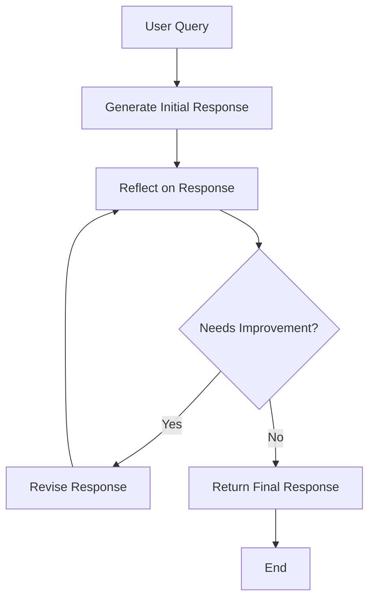

# Reflection Pattern

**Problem**: AI agents often produce suboptimal outputs on the first attempt, lacking self-awareness about response quality.

**Solution**: Implement a self-reflection mechanism where agents critique and iteratively improve their own outputs.

## Overview

The Reflection Pattern enables AI agents to improve their responses through iterative self-critique and revision. This pattern is particularly effective for:

- **Complex explanations** that benefit from multiple refinements
- **Creative content** that can be enhanced through iteration
- **Technical writing** that needs accuracy and completeness
- **Educational content** that requires clarity and accessibility

## Implementation

The implementation consists of:

- `reflection_agent.py` - Main agent implementation using LangGraph
- `test_reflection_agent.py` - Comprehensive test suite
- `example.py` - Example usage script
- `requirements.txt` - Dependencies

## Architecture

The agent uses LangGraph to create a state machine with three main nodes:

### 1. Generate Node
- Creates an initial response to the user query
- Uses a comprehensive system prompt for quality
- Focuses on accuracy, completeness, and structure

### 2. Reflect Node
- Critically analyzes the current response
- Evaluates accuracy, completeness, clarity, and relevance
- Provides specific, actionable feedback for improvement

### 3. Revise Node
- Improves the response based on the critique
- Maintains strengths while addressing weaknesses
- Produces an enhanced version of the content

## Workflow



## Usage

### Basic Usage

```python
from reflection_agent import ReflectionAgent

# Initialize the agent
agent = ReflectionAgent(max_iterations=3)

# Run with reflection
result = agent.run("Explain quantum computing to a high school student")

print(f"Final response: {result.content}")
print(f"Iterations: {result.iteration}")
print(f"Final critique: {result.critique}")
```

### Streaming Usage

```python
# Watch the reflection process step by step
agent.stream_reflection("Write a poem about artificial intelligence", max_iterations=2)
```

### Advanced Configuration

```python
# Custom configuration
agent = ReflectionAgent(
    model_name="gpt-4o-mini",  # or "gpt-4"
    max_iterations=5
)

# Run with custom iteration limit
result = agent.run("Complex query here", max_iterations=2)
```

## Running the Examples

### Quick Example
```bash
# Install dependencies
pip install -r requirements.txt

# Set your OpenAI API key in .env file
cp ../.env.example .env
# Edit .env and add your OPENAI_API_KEY

# Run the example script
python example.py
```

### Interactive Demo
```bash
# Run the interactive demo
python reflection_agent.py
```

### Streaming Demo
```bash
# In interactive mode, use 'stream' prefix:
# stream Explain the theory of relativity
```

### Running Tests
```bash
# Run the test suite
python -m pytest test_reflection_agent.py -v
```