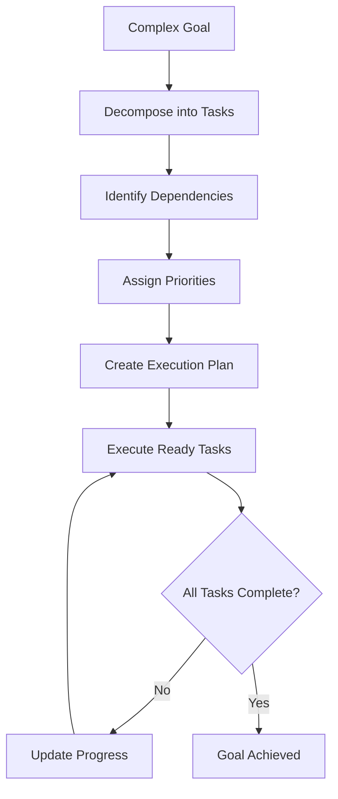

# Hierarchical Planning Pattern

**Problem**: Complex goals require systematic decomposition into manageable subtasks with proper dependency management.

**Solution**: Implement a hierarchical planning system that breaks down goals into structured task trees with dependency tracking.

## Overview

The Hierarchical Planning Pattern enables AI agents to tackle complex goals by breaking them down into structured, manageable tasks. This pattern is particularly effective for:

- **Complex Projects** with multiple phases and dependencies
- **Event Planning** with coordinated workstreams
- **Software Development** with structured development cycles
- **Research Projects** with systematic methodologies
- **Workflow Automation** with interdependent steps

## Implementation

The implementation consists of:

- `hierarchical_planner.py` - Main planner implementation using LangGraph
- `task_models.py` - Task and plan data structures
- `test_hierarchical_planner.py` - Comprehensive test suite
- `example.py` - Example usage script
- `requirements.txt` - Dependencies

## Architecture

The system uses several key components:

### Task Model
```python
@dataclass
class Task:
    id: str
    title: str
    description: str
    status: TaskStatus  # PENDING, IN_PROGRESS, COMPLETED, FAILED, BLOCKED
    priority: TaskPriority  # CRITICAL, HIGH, MEDIUM, LOW
    dependencies: List[str]  # Task IDs this task depends on
    subtasks: List['Task']
    estimated_duration: Optional[int]  # in minutes
```

### Execution Plan
- Manages the complete task hierarchy
- Tracks dependencies and execution readiness
- Provides progress monitoring and statistics
- Handles task completion and failure states

### Planning Workflow



## Usage

### Basic Planning

```python
from hierarchical_planner import HierarchicalPlanner
from task_models import PlanningRequest

# Initialize the planner
planner = HierarchicalPlanner()

# Create a planning request
request = PlanningRequest(
    goal="Launch a mobile app",
    context="iOS and Android, social features, 3-month timeline",
    max_depth=3,
    max_tasks_per_level=5
)

# Generate the plan
plan = planner.create_plan(request)

# Display the hierarchy
print(plan.get_task_hierarchy_display())
```

### Plan Execution

```python
# Execute the plan
executed_plan = planner.execute_plan(plan)

# Check progress
progress = executed_plan.get_progress_summary()
print(f"Completed: {progress['completed_tasks']}/{progress['total_tasks']}")
print(f"Success rate: {progress['progress_percentage']:.1f}%")
```

### Task Management

```python
# Get tasks ready for execution
ready_tasks = plan.get_ready_tasks()
for task in ready_tasks:
    print(f"Ready: {task.title} (Priority: {task.priority.value})")

# Mark task as completed
plan.mark_task_completed(task.id, "Task completed successfully")

# Check if plan is complete
if plan.is_complete():
    print("All tasks completed!")
```