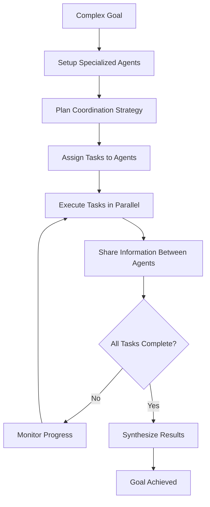

# Multi-Agent Coordination Pattern

**Problem**: Complex tasks require diverse expertise and parallel execution that single agents cannot efficiently handle.

**Solution**: Implement a coordination system where multiple specialized agents work together, sharing information and coordinating their efforts to achieve common goals.

## Overview

The Multi-Agent Coordination Pattern enables multiple AI agents with different specializations to collaborate effectively. This pattern is particularly effective for:

- **Complex Projects** requiring diverse expertise
- **Research Tasks** with multiple parallel workstreams  
- **Content Creation** involving multiple roles (research, writing, review)
- **Analysis Projects** requiring different analytical perspectives
- **Workflow Automation** with specialized processing steps

## Implementation

The implementation consists of:

- `multi_agent_coordinator.py` - Main coordinator implementation using LangGraph
- `agent_models.py` - Agent, task, and coordination data structures
- `test_multi_agent_coordinator.py` - Comprehensive test suite
- `example.py` - Example usage script
- `requirements.txt` - Dependencies

## Architecture

The system uses several key components:

### Agent Model
```python
@dataclass
class Agent:
    id: str
    name: str
    role: AgentRole  # COORDINATOR, RESEARCHER, ANALYST, WRITER, etc.
    capabilities: List[AgentCapability]
    status: AgentStatus  # IDLE, BUSY, WAITING, ERROR, OFFLINE
    current_task: Optional[str]
    message_history: List[Message]
    knowledge_base: Dict[str, Any]
```

### Coordination Task
```python
@dataclass
class CoordinationTask:
    id: str
    title: str
    description: str
    required_capabilities: List[str]
    assigned_agents: List[str]
    status: str  # pending, in_progress, completed, failed
    result: Optional[str]
```

### Coordination Workflow



## Usage

### Basic Coordination

```python
from multi_agent_coordinator import MultiAgentCoordinator
from agent_models import CoordinationRequest

# Initialize the coordinator
coordinator = MultiAgentCoordinator()

# Create a coordination request
request = CoordinationRequest(
    goal="Create a comprehensive market research report",
    context="AI tools market, focus on enterprise segment",
    required_roles=["researcher", "analyst", "writer", "reviewer"],
    max_agents=4
)

# Execute coordination
plan = coordinator.coordinate(request)

# Check results
for task in plan.tasks:
    print(f"Task: {task.title}")
    print(f"Status: {task.status}")
    if task.result:
        print(f"Result: {task.result[:100]}...")
```

### Agent Team Management

```python
# Check agent team
for agent in plan.agents.values():
    print(f"Agent: {agent.name} ({agent.role.value})")
    print(f"Capabilities: {[cap.name for cap in agent.capabilities]}")
    print(f"Status: {agent.status.value}")

# Get available agents for specific capabilities
available_researchers = plan.get_available_agents("research")
available_writers = plan.get_available_agents("writing")
```

### Message and Collaboration Tracking

```python
# Check agent collaboration
for message in plan.message_queue:
    sender = plan.agents.get(message.sender_id, {}).name
    recipient = message.recipient_id
    print(f"{sender} → {recipient}: {message.content}")

# Get progress summary
progress = plan.get_progress_summary()
print(f"Completed: {progress['completed_tasks']}/{progress['total_tasks']}")
print(f"Success rate: {progress['progress_percentage']:.1f}%")
```

## Running the Examples

### Quick Example
```bash
# Install dependencies
pip install -r requirements.txt

# Set your OpenAI API key in .env file
cp ../.env.example .env
# Edit .env and add your OPENAI_API_KEY

# Run the example script
python example.py
```

### Interactive Demo
```bash
# Run the interactive demo
python multi_agent_coordinator.py
```

### Running Tests
```bash
# Run the test suite
python -m pytest test_multi_agent_coordinator.py -v
```

## Key Features

- **Specialized Agents**: Each agent has specific roles and capabilities
- **Dynamic Task Assignment**: Tasks assigned based on agent capabilities and availability
- **Inter-Agent Communication**: Agents can share information and coordinate efforts
- **Parallel Execution**: Multiple agents work simultaneously on different tasks
- **Progress Monitoring**: Real-time tracking of coordination progress
- **Rich Visualization**: Beautiful console output showing agent teams and coordination
- **Comprehensive Testing**: Full test suite covering all coordination components
- **Flexible Configuration**: Adjustable team size and role requirements

## Agent Roles

The system supports various agent roles:

- **COORDINATOR**: Manages overall coordination and task distribution
- **RESEARCHER**: Conducts research and gathers information
- **ANALYST**: Analyzes data and provides insights
- **WRITER**: Creates content and documentation
- **REVIEWER**: Reviews and validates work quality
- **EXECUTOR**: Executes specific tasks and operations
- **SPECIALIST**: Provides domain-specific expertise

## Coordination Benefits

### Parallel Processing
- Multiple agents work simultaneously
- Reduced overall completion time
- Efficient resource utilization

### Specialized Expertise
- Each agent focuses on their strengths
- Higher quality outputs in specialized areas
- Reduced cognitive load per agent

### Information Sharing
- Agents share findings and insights
- Collective knowledge building
- Reduced duplication of effort

### Scalability
- Easy to add more agents for larger tasks
- Dynamic team composition based on requirements
- Flexible role assignment

## Use Cases

### Content Creation Pipeline
- **Researcher**: Gathers information and sources
- **Writer**: Creates initial content drafts
- **Reviewer**: Checks quality and accuracy
- **Editor**: Finalizes and polishes content

### Market Analysis Project
- **Data Collector**: Gathers market data
- **Analyst**: Analyzes trends and patterns
- **Strategist**: Develops insights and recommendations
- **Reporter**: Synthesizes findings into reports

### Software Development
- **Architect**: Designs system architecture
- **Developer**: Implements features
- **Tester**: Validates functionality
- **Documenter**: Creates technical documentation

## Security Considerations

- **Agent Isolation**: Each agent operates in its own context
- **Message Validation**: All inter-agent messages are validated
- **Access Control**: Agents only access information relevant to their tasks
- **Error Handling**: Failed agents don't compromise the entire coordination
- **Resource Management**: Prevents any single agent from consuming excessive resources
