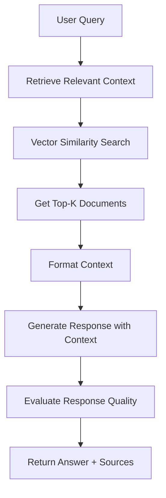

# RAG-Enhanced Agent Pattern

**Problem**: AI agents are limited by their training data and cannot access current, domain-specific, or private information.

**Solution**: Implement Retrieval-Augmented Generation (RAG) to combine large language models with external knowledge retrieval for more accurate and up-to-date responses.

## Overview

The RAG-Enhanced Agent Pattern enables AI agents to access and utilize external knowledge sources dynamically. This pattern is particularly effective for:

- **Knowledge-Based Q&A** systems with domain-specific information
- **Document Analysis** and information extraction
- **Customer Support** with access to product documentation
- **Research Assistance** with scientific papers and reports
- **Technical Documentation** queries and code assistance

## Implementation

The implementation consists of:

- `rag_agent.py` - Main RAG agent implementation using LangGraph
- `document_processor.py` - Document loading and chunking utilities
- `vector_store.py` - Vector database management with ChromaDB
- `test_rag_agent.py` - Comprehensive test suite
- `example.py` - Example usage script
- `requirements.txt` - Dependencies

## Architecture

The system uses several key components:

### Document Processing Pipeline
```python
Document → Chunking → Embedding → Vector Store
```

### RAG Workflow


### Core Components

#### Document Processor
- Supports multiple file formats (TXT, PDF, DOCX, MD)
- Intelligent text chunking with overlap
- Token counting and metadata extraction
- Batch processing for directories

#### Vector Store Manager
- ChromaDB integration for persistent storage
- OpenAI embeddings for semantic search
- Similarity search with configurable thresholds
- Collection statistics and management

#### RAG Agent
- LangGraph-based workflow orchestration
- Context retrieval and response generation
- Confidence scoring and quality evaluation
- Source attribution and traceability

## Usage

### Basic RAG Agent

```python
from rag_agent import RAGEnhancedAgent
from vector_store import VectorStoreConfig

# Initialize agent
config = VectorStoreConfig(
    collection_name="my_knowledge_base",
    similarity_threshold=0.7
)
agent = RAGEnhancedAgent(vector_store_config=config)

# Add documents to knowledge base
agent.add_documents_from_directory("./documents")

# Query the agent
response = agent.query("What is machine learning?")
print(f"Answer: {response.answer}")
print(f"Confidence: {response.confidence_score:.2f}")
print(f"Sources: {len(response.sources)}")
```

### Document Processing

```python
from document_processor import DocumentProcessor

# Initialize processor
processor = DocumentProcessor(chunk_size=1000, chunk_overlap=200)

# Process single file
chunks, metadata = processor.process_file("document.pdf")

# Process directory
all_chunks, all_metadata = processor.process_directory("./docs", recursive=True)

# Process raw text
text_chunks = processor.process_text("Your text content here", "source_name")
```

### Vector Store Management

```python
from vector_store import VectorStoreManager, VectorStoreConfig

# Initialize vector store
config = VectorStoreConfig(persist_directory="./my_vector_db")
vector_store = VectorStoreManager(config)

# Add documents
document_ids = vector_store.add_documents(chunks)

# Search for similar content
results = vector_store.similarity_search("query", k=5)

# Get formatted context
context = vector_store.get_relevant_context("query", max_chunks=3)
```

## Running the Examples

### Quick Example
```bash
# Install dependencies
pip install -r requirements.txt

# Set your OpenAI API key in .env file
cp ../.env.example .env
# Edit .env and add your OPENAI_API_KEY

# Run the example script
python example.py
```

### Interactive Demo
```bash
# Run the interactive demo with sample documents
python rag_agent.py
```

### Running Tests
```bash
# Run the test suite
python -m pytest test_rag_agent.py -v
```

## Key Features

- **Multi-Format Support**: Process TXT, PDF, DOCX, and Markdown files
- **Intelligent Chunking**: Recursive text splitting with configurable overlap
- **Semantic Search**: Vector similarity search with OpenAI embeddings
- **Persistent Storage**: ChromaDB for efficient vector storage and retrieval
- **Quality Assessment**: Confidence scoring for response evaluation
- **Source Attribution**: Clear traceability to original documents
- **Rich Visualization**: Beautiful console output with progress indicators
- **Comprehensive Testing**: Full test suite covering all components

## Configuration Options

### Vector Store Configuration
```python
config = VectorStoreConfig(
    collection_name="my_collection",
    persist_directory="./vector_db",
    embedding_model="text-embedding-3-small",
    chunk_size=1000,
    chunk_overlap=200,
    similarity_threshold=0.7
)
```

### Document Processing Options
```python
processor = DocumentProcessor(
    chunk_size=1500,        # Larger chunks for more context
    chunk_overlap=300       # More overlap for better continuity
)
```

## Supported File Types

- **Text Files**: `.txt`, `.md`
- **PDF Documents**: `.pdf` (using PyPDF)
- **Word Documents**: `.docx` (using python-docx)
- **Raw Text**: Direct text input via API

## Performance Optimization

### Chunking Strategy
- **Small Chunks (500-800 tokens)**: Better precision, more granular retrieval
- **Large Chunks (1000-1500 tokens)**: More context, better for complex queries
- **Overlap**: 10-20% of chunk size for continuity

### Embedding Models
- **text-embedding-3-small**: Fast, cost-effective, good quality
- **text-embedding-3-large**: Higher quality, more expensive
- **text-embedding-ada-002**: Legacy model, still effective

### Search Parameters
- **k (top-k)**: Number of chunks to retrieve (3-10 typical)
- **Similarity Threshold**: Filter low-relevance results (0.6-0.8)
- **Max Context**: Total context length for generation

## Use Cases

### Customer Support
```python
# Add product documentation
agent.add_documents_from_directory("./product_docs")

# Answer customer questions
response = agent.query("How do I reset my password?")
```

### Research Assistant
```python
# Add research papers
agent.add_documents_from_directory("./research_papers")

# Query research topics
response = agent.query("What are the latest developments in transformer models?")
```

### Code Documentation
```python
# Add code documentation
agent.add_documents_from_directory("./api_docs")

# Answer technical questions
response = agent.query("How do I authenticate with the API?")
```

## Benefits

- **Current Information**: Access to up-to-date documents beyond training data
- **Domain Expertise**: Specialized knowledge from domain-specific documents
- **Reduced Hallucinations**: Grounded responses based on actual sources
- **Transparency**: Clear source attribution for fact-checking
- **Scalability**: Easy to add new documents without retraining
- **Cost-Effective**: No need for expensive model fine-tuning
- **Flexibility**: Works with various document types and formats

## Security Considerations

- **Data Privacy**: Documents stored locally in vector database
- **Access Control**: Implement authentication for sensitive documents
- **Input Validation**: Sanitize user queries and document content
- **API Security**: Secure OpenAI API key management
- **Audit Trail**: Track document access and query patterns

## Troubleshooting

### Common Issues

1. **Empty Search Results**
   - Check similarity threshold (try lowering to 0.5-0.6)
   - Verify documents were properly indexed
   - Ensure query matches document content style

2. **Poor Response Quality**
   - Increase chunk overlap for better context
   - Adjust chunk size for your content type
   - Review document quality and relevance

3. **Performance Issues**
   - Reduce number of retrieved chunks (k parameter)
   - Optimize chunk size for your use case
   - Consider using smaller embedding model

### Debug Commands
```python
# Check knowledge base statistics
agent.get_knowledge_base_stats()

# Search knowledge base directly
agent.search_knowledge_base("your query", k=10)

# View vector store configuration
print(agent.vector_store_config)
```
