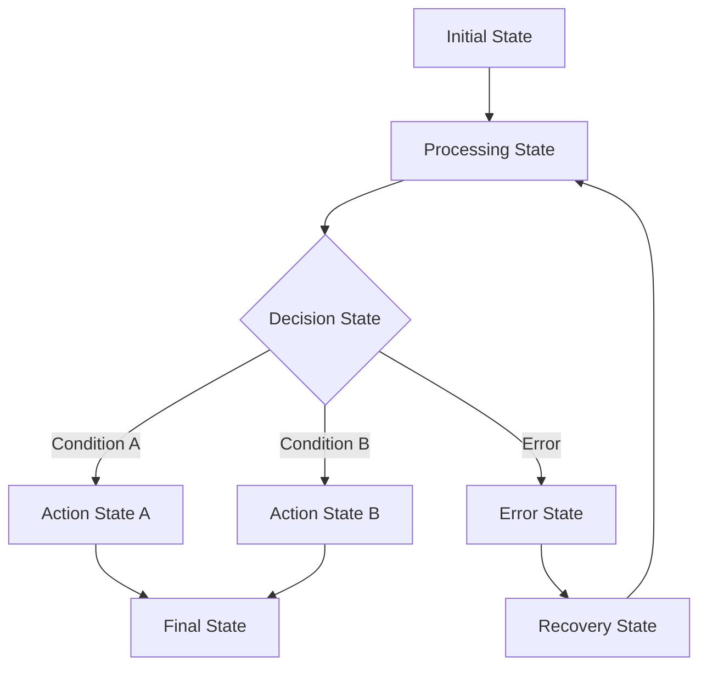

# State Machine Pattern

**Problem**: AI agents often exhibit unpredictable behavior, making it difficult to debug, maintain, and ensure reliable operation.

**Solution**: Implement explicit state machines with defined states, transitions, and conditions to create predictable, traceable agent behavior.

## Overview

The State Machine Pattern provides a structured approach to agent behavior by defining explicit states and the conditions for transitioning between them. This pattern is particularly effective for:

- **Workflow Automation** with clear steps and decision points
- **Customer Support** systems with defined interaction flows
- **Content Processing** pipelines with validation and quality checks
- **Multi-step Tasks** requiring sequential or conditional execution
- **Error Handling** with defined recovery paths

## Implementation

The implementation consists of:

- `state_machine_agent.py` - Main state machine agent using LangGraph
- `state_models.py` - State machine data structures and base classes
- `test_state_machine_agent.py` - Comprehensive test suite
- `example.py` - Example usage script
- `requirements.txt` - Dependencies

## Architecture

The system uses several key components:

### State Types
```python
class StateType(Enum):
    INITIAL = "initial"      # Entry point
    PROCESSING = "processing" # Data processing
    DECISION = "decision"    # Decision making
    WAITING = "waiting"      # Waiting for input/events
    ACTION = "action"        # Performing actions
    FINAL = "final"          # Successful completion
    ERROR = "error"          # Error handling
```

### Transition Conditions
```python
class TransitionCondition(Enum):
    ALWAYS = "always"           # Unconditional transition
    ON_SUCCESS = "on_success"   # When no errors occurred
    ON_FAILURE = "on_failure"   # When errors occurred
    ON_TIMEOUT = "on_timeout"   # When timeout reached
    ON_CONDITION = "on_condition" # Custom condition function
```

### State Machine Workflow



## Usage

### Basic State Machine

```python
from state_machine_agent import StateMachineAgent
from state_models import (
    StateMachineDefinition, StateContext, Transition, TransitionCondition,
    InitialState, FinalState, ProcessingState
)

# Initialize agent
agent = StateMachineAgent()

# Create state machine definition
definition = StateMachineDefinition(
    name="simple_workflow",
    description="Simple processing workflow",
    initial_state="start"
)

# Add states
definition.add_state(InitialState("start"))
definition.add_state(ProcessingState("process", processor=my_processor))
definition.add_state(FinalState("end"))

# Add transitions
definition.add_transition(Transition("start", "process", TransitionCondition.ALWAYS))
definition.add_transition(Transition("process", "end", TransitionCondition.ON_SUCCESS))

# Register and execute
agent.register_state_machine(definition)
context = StateContext(user_input="Hello, world!")
result = agent.execute_state_machine("simple_workflow", context)
```

### LLM-Integrated States

```python
# Create LLM processing state
processing_state = agent.create_llm_processing_state(
    name="analyze",
    system_prompt="Analyze the user input and extract key information.",
    description="Analyze user input"
)

# Create LLM decision state
decision_state = agent.create_llm_decision_state(
    name="classify",
    system_prompt="Classify the input type.",
    decision_options=["question", "request", "complaint"],
    description="Classify input type"
)
```

### Custom State Implementation

```python
class CustomProcessingState(ProcessingState):
    def __init__(self, name: str):
        def custom_processor(context: StateContext) -> StateContext:
            # Custom processing logic
            context.current_data['processed'] = True
            return context
        
        super().__init__(name, "Custom processing", custom_processor)
```

### Conditional Transitions

```python
# Custom condition function
def check_user_level(context: StateContext) -> bool:
    return context.current_data.get('user_level') == 'advanced'

# Add conditional transition
definition.add_transition(Transition(
    from_state="analyze",
    to_state="advanced_processing",
    condition=TransitionCondition.ON_CONDITION,
    condition_func=check_user_level
))
```

## Running the Examples

### Quick Example
```bash
# Install dependencies
pip install -r requirements.txt

# Set your OpenAI API key in .env file
cp ../.env.example .env
# Edit .env and add your OPENAI_API_KEY

# Run the example script
python example.py
```

### Interactive Demo
```bash
# Run the interactive demo
python state_machine_agent.py
```

### Running Tests
```bash
# Run the test suite
python -m pytest test_state_machine_agent.py -v
```

## Key Features

- **Explicit State Definition**: Clear, named states with specific purposes
- **Conditional Transitions**: Flexible transition logic based on context
- **LLM Integration**: Built-in support for LLM-powered states
- **Error Handling**: Dedicated error states and recovery paths
- **Execution Tracing**: Complete audit trail of state transitions
- **Visualization**: Graphviz integration for state machine diagrams
- **Timeout Management**: Automatic timeout handling and recovery
- **Rich Console Output**: Beautiful visualization of execution flow

## State Machine Examples

### Customer Support Workflow
```python
# States: greeting → classify_intent → [technical|billing|general] → satisfaction_check → closing
# Demonstrates intent-based routing and satisfaction loops
```

### Task Planning System
```python
# States: analyze → assess_complexity → [simple|moderate|complex]_planning → review → finalize
# Demonstrates complexity-based processing paths
```

### Content Processing Pipeline
```python
# States: validate → process → quality_check → [approve|improve] → finalize
# Demonstrates quality control loops and validation
```

## Benefits

### Predictability
- **Deterministic Behavior**: Same inputs produce same state transitions
- **Clear Flow**: Explicit paths through the system
- **Reproducible Results**: Consistent execution patterns

### Maintainability
- **Modular Design**: States can be modified independently
- **Clear Dependencies**: Explicit transition conditions
- **Easy Debugging**: Trace execution through states

### Reliability
- **Error Isolation**: Errors contained within states
- **Recovery Paths**: Defined error handling and recovery
- **Timeout Protection**: Automatic timeout management

### Transparency
- **Audit Trail**: Complete history of state transitions
- **Visual Representation**: Graphical state machine diagrams
- **Execution Metrics**: Performance and success tracking

## Advanced Features

### State Entry/Exit Actions
```python
def log_entry(context: StateContext):
    context.add_to_history(f"Entered state at {datetime.now()}")

state.add_entry_action(log_entry)
```

### Complex Transition Logic
```python
def complex_condition(context: StateContext) -> bool:
    return (context.iteration_count < 3 and 
            context.current_data.get('score', 0) > 0.8)
```

### State Machine Validation
```python
# Automatic validation checks:
# - All referenced states exist
# - At least one final state defined
# - No unreachable states
# - Valid transition conditions

errors = definition.validate()
if errors:
    print(f"Validation errors: {errors}")
```

### Visualization and Documentation
```python
# Generate Graphviz diagram
agent.visualize_state_machine("workflow_name", save_path="diagram")

# Get machine information
info = agent.get_state_machine_info("workflow_name")
print(f"States: {len(info['states'])}")
print(f"Transitions: {len(info['transitions'])}")
```

## Use Cases

### Workflow Automation
- Document processing pipelines
- Approval workflows
- Data validation sequences

### Interactive Systems
- Chatbot conversation flows
- Customer service interactions
- Multi-step form processing

### Content Management
- Content creation workflows
- Review and approval processes
- Publishing pipelines

### Decision Support
- Multi-criteria decision making
- Risk assessment workflows
- Compliance checking

## Security Considerations

- **State Isolation**: Each state operates independently
- **Input Validation**: Validate inputs at state boundaries
- **Access Control**: Control state transitions based on permissions
- **Audit Logging**: Complete trail of state changes
- **Error Containment**: Prevent error propagation between states

## Performance Optimization

### State Design
- Keep states focused and lightweight
- Minimize data passed between states
- Use efficient transition conditions

### Execution Optimization
- Set appropriate timeout values
- Limit maximum iterations
- Use early termination conditions

### Memory Management
- Clean up context data when no longer needed
- Limit history size for long-running workflows
- Use streaming for large data processing
