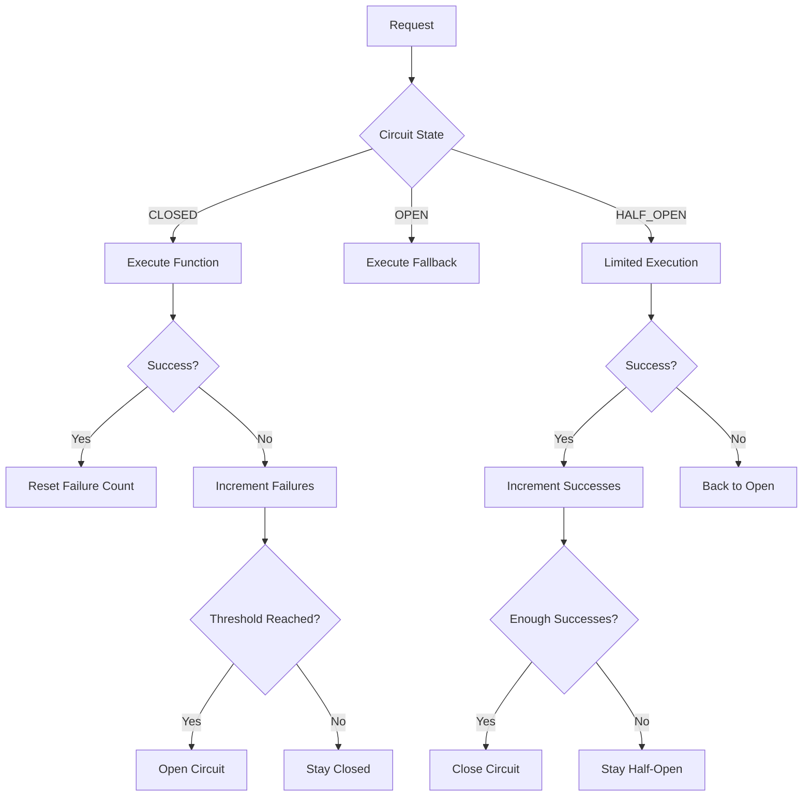

# Circuit Breaker Pattern

**Problem**: AI agents can fail catastrophically when dependent services become unavailable, leading to cascading failures and poor user experience.

**Solution**: Implement circuit breakers that monitor service health and provide graceful degradation with fallback responses when failures occur.

## Overview

The Circuit Breaker Pattern protects AI agents from cascading failures by monitoring the health of external dependencies and automatically switching to fallback behavior when services become unreliable. This pattern is particularly effective for:

- **External API Integration** with unreliable third-party services
- **LLM Service Protection** against rate limits and timeouts
- **Database Connection Management** with automatic failover
- **Microservices Communication** in distributed systems
- **Quality Assurance** with automatic fallback for poor responses

## Implementation

The implementation consists of:

- `circuit_breaker.py` - Core circuit breaker implementation
- `resilient_agent.py` - Resilient agent using circuit breakers with LangGraph
- `test_circuit_breaker.py` - Comprehensive test suite
- `example.py` - Example usage script
- `requirements.txt` - Dependencies

## Architecture

The system uses several key components:

### Circuit States
```python
class CircuitState(Enum):
    CLOSED = "closed"        # Normal operation
    OPEN = "open"           # Failing, blocking requests
    HALF_OPEN = "half_open" # Testing if service recovered
```

### Circuit Breaker Workflow



### Failure Types
```python
class FailureType(Enum):
    TIMEOUT = "timeout"
    ERROR = "error"
    RATE_LIMIT = "rate_limit"
    QUALITY_THRESHOLD = "quality_threshold"
    CUSTOM = "custom"
```

## Usage

### Basic Circuit Breaker

```python
from circuit_breaker import CircuitBreaker, CircuitBreakerConfig, SimpleFallback

# Configure circuit breaker
config = CircuitBreakerConfig(
    failure_threshold=5,      # Open after 5 failures
    recovery_timeout=60.0,    # Try recovery after 60 seconds
    success_threshold=3,      # Close after 3 successes
    timeout_duration=30.0     # 30 second timeout
)

# Create fallback strategy
fallback = SimpleFallback("Service temporarily unavailable")

# Create circuit breaker
cb = CircuitBreaker("My Service", config, fallback)

# Protected function call
def unreliable_service():
    # Your service call here
    return "Service response"

result = cb.call(unreliable_service)
if result.success:
    print(f"Response: {result.response}")
else:
    print(f"Failed: {result.error}")
```

### Resilient Agent

```python
from resilient_agent import ResilientAgent

# Initialize resilient agent
agent = ResilientAgent()

# Query with circuit breaker protection
response = agent.query("What is machine learning?")

print(f"Response: {response.content}")
print(f"Used fallback: {response.used_fallback}")
print(f"Circuit state: {response.circuit_state}")
```

### Quality-Based Circuit Breaking

```python
def quality_evaluator(response: str) -> float:
    """Evaluate response quality (0.0 to 1.0)."""
    if len(response) < 10:
        return 0.2
    elif "error" in response.lower():
        return 0.3
    else:
        return 0.8

result = cb.call(
    my_function,
    quality_evaluator=quality_evaluator
)
```

### Custom Fallback Strategies

```python
from circuit_breaker import CachedFallback, DegradedServiceFallback

# Cached fallback
cached_fallback = CachedFallback()
cached_fallback.add_to_cache("greeting", "Hello! Service is temporarily down.")
cached_fallback.add_to_cache("error", "We're experiencing technical difficulties.")

# Degraded service fallback
def simple_response(query):
    return f"I received your query: {query}. Please try again later."

degraded_fallback = DegradedServiceFallback(simple_response)
```

## Running the Examples

### Quick Example
```bash
# Install dependencies
pip install -r requirements.txt

# Set your OpenAI API key in .env file
cp ../.env.example .env
# Edit .env and add your OPENAI_API_KEY

# Run the example script
python example.py
```

### Interactive Demo
```bash
# Run the interactive demo
python resilient_agent.py
```

### Running Tests
```bash
# Run the test suite
python -m pytest test_circuit_breaker.py -v
```

## Key Features

- **Multiple Circuit States**: Closed, Open, and Half-Open states with automatic transitions
- **Configurable Thresholds**: Customizable failure and success thresholds
- **Quality Assessment**: Built-in quality evaluation for response validation
- **Rate Limiting**: Automatic rate limiting to prevent service overload
- **Timeout Protection**: Configurable timeouts for hanging requests
- **Fallback Strategies**: Multiple fallback options (simple, cached, degraded service)
- **Metrics Collection**: Comprehensive metrics and monitoring
- **Thread Safety**: Safe for concurrent use
- **Manual Control**: Manual reset and force-open capabilities

## Configuration Options

### Circuit Breaker Configuration
```python
config = CircuitBreakerConfig(
    failure_threshold=5,          # Failures to open circuit
    recovery_timeout=60.0,        # Seconds before trying half-open
    success_threshold=3,          # Successes to close from half-open
    timeout_duration=30.0,        # Request timeout in seconds
    quality_threshold=0.7,        # Minimum quality score (0-1)
    rate_limit_per_minute=60,     # Maximum requests per minute
    sliding_window_size=100,      # Size of metrics sliding window
    half_open_max_calls=5         # Max calls in half-open state
)
```

### Resilient Agent Configuration
```python
# The agent automatically creates circuit breakers for:
# - LLM Service: Main language model calls
# - Quality Service: Response quality assessment
# - External API: Third-party service calls
```

## Fallback Strategies

### Simple Fallback
```python
fallback = SimpleFallback("Service temporarily unavailable")
```

### Cached Fallback
```python
fallback = CachedFallback()
fallback.add_to_cache("greeting", "Hello! I'm having issues right now.")
fallback.add_to_cache("question", "I can't process questions at the moment.")
```

### Degraded Service Fallback
```python
def degraded_function(query):
    return f"Limited response for: {query}"

fallback = DegradedServiceFallback(degraded_function)
```

## Monitoring and Metrics

### Circuit Breaker Metrics
```python
metrics = cb.get_metrics()

print(f"Total calls: {metrics.total_calls}")
print(f"Success rate: {metrics.success_rate:.2%}")
print(f"Average response time: {metrics.average_response_time:.3f}s")
print(f"Current state: {metrics.current_state}")
print(f"Consecutive failures: {metrics.consecutive_failures}")
```

### Agent Status
```python
# Get status of all circuit breakers
status = agent.get_circuit_breaker_status()

# Display formatted status
agent.display_circuit_breaker_status()
```

## Advanced Features

### Manual Circuit Control
```python
# Force circuit open (for maintenance)
cb.force_open()

# Reset circuit to closed state
cb.reset()

# Check if circuit should attempt reset
if cb._should_attempt_reset():
    cb._transition_to_half_open()
```

### Custom Quality Evaluation
```python
def advanced_quality_evaluator(response: str) -> float:
    score = 0.5
    
    # Length check
    if len(response) > 100:
        score += 0.2
    
    # Content quality
    if any(word in response.lower() for word in ["detailed", "comprehensive"]):
        score += 0.2
    
    # Negative indicators
    if any(word in response.lower() for word in ["error", "failed", "unknown"]):
        score -= 0.3
    
    return max(0.0, min(1.0, score))
```

### Rate Limiting
```python
# Circuit breaker automatically handles rate limiting
# based on configured rate_limit_per_minute

# Check rate limit status
if not cb._check_rate_limit():
    print("Rate limit exceeded")
```

## Use Cases

### API Gateway Protection
```python
# Protect against unreliable external APIs
api_cb = CircuitBreaker("External API", config, cached_fallback)

def call_external_api(data):
    # External API call
    return requests.post("https://api.example.com", json=data)

result = api_cb.call(call_external_api, {"query": "test"})
```

### Database Connection Management
```python
# Protect against database connection issues
db_cb = CircuitBreaker("Database", config, SimpleFallback("Database unavailable"))

def database_query(sql):
    # Database query
    return db.execute(sql)

result = db_cb.call(database_query, "SELECT * FROM users")
```

### LLM Service Protection
```python
# Protect against LLM service issues
llm_cb = CircuitBreaker("LLM", config, cached_fallback)

def llm_call(prompt):
    return openai.chat.completions.create(
        model="gpt-4",
        messages=[{"role": "user", "content": prompt}]
    )

result = llm_cb.call(llm_call, "What is AI?")
```

## Benefits

### Resilience
- **Failure Isolation**: Prevents cascading failures
- **Fast Failure**: Quick response when services are down
- **Automatic Recovery**: Self-healing when services recover

### Performance
- **Timeout Protection**: Prevents hanging requests
- **Rate Limiting**: Protects against overload
- **Resource Conservation**: Avoids wasting resources on failing services

### User Experience
- **Graceful Degradation**: Fallback responses maintain functionality
- **Consistent Availability**: Service remains available even with failures
- **Transparent Operation**: Users get responses even during issues

### Operational
- **Monitoring**: Real-time visibility into service health
- **Alerting**: Early warning of service degradation
- **Manual Control**: Ability to manually control circuit state

## Security Considerations

- **Input Validation**: Validate all inputs to protected functions
- **Fallback Security**: Ensure fallback responses don't leak sensitive information
- **Rate Limiting**: Protect against abuse and DoS attacks
- **Monitoring**: Log all circuit breaker events for security analysis
- **Access Control**: Restrict manual circuit breaker control

## Performance Optimization

### Configuration Tuning
- Adjust failure thresholds based on service reliability
- Set appropriate timeouts for your use case
- Configure rate limits based on service capacity

### Fallback Optimization
- Use cached responses for better performance
- Implement lightweight degraded services
- Pre-populate caches with common responses

### Monitoring Optimization
- Limit sliding window size for memory efficiency
- Use appropriate metrics collection intervals
- Implement efficient logging and alerting
