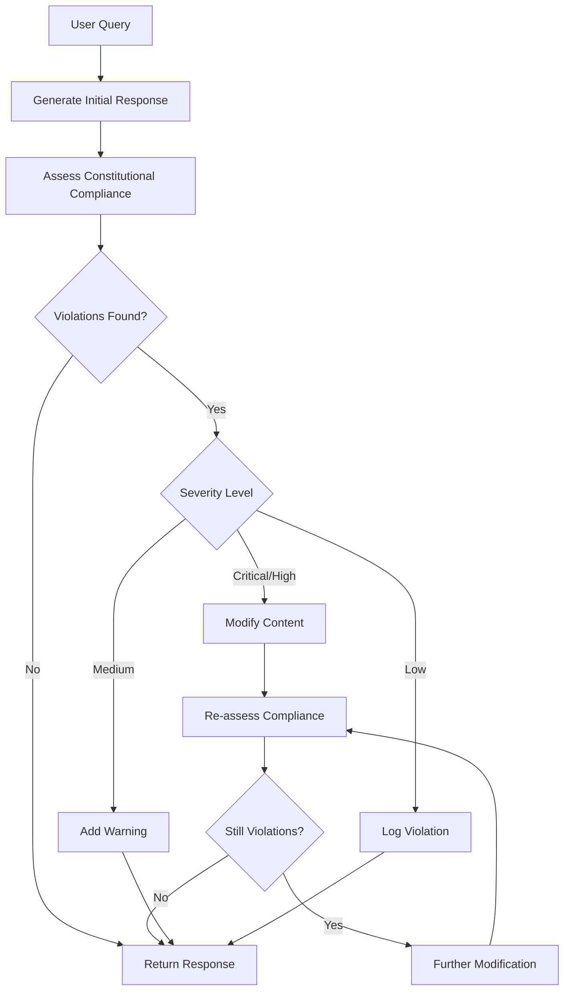

# Constitutional AI Pattern

**Problem**: AI agents can generate harmful, biased, or unethical content without built-in safeguards and ethical guidelines.

**Solution**: Implement constitutional principles that are embedded into the AI agent's decision-making process to ensure safe, ethical, and responsible behavior.

## Overview

The Constitutional AI Pattern embeds ethical principles directly into AI agents, creating a framework for consistent, safe, and responsible AI behavior. This pattern is particularly effective for:

- **Content Moderation** with automated safety checks
- **Customer Service** with ethical interaction guidelines
- **Educational AI** with age-appropriate content filtering
- **Healthcare AI** with privacy and safety protections
- **Legal AI** with bias prevention and fairness assurance

## Implementation

The implementation consists of:

- `constitutional_agent.py` - Main constitutional AI agent using LangGraph
- `constitutional_models.py` - Constitutional principles and assessment models
- `test_constitutional_ai.py` - Comprehensive test suite
- `example.py` - Example usage script
- `requirements.txt` - Dependencies

## Architecture

The system uses several key components:

### Constitutional Principles
```python
class PrincipleType(Enum):
    SAFETY = "safety"           # Physical and psychological safety
    ETHICS = "ethics"           # Moral and ethical guidelines
    PRIVACY = "privacy"         # Personal information protection
    ACCURACY = "accuracy"       # Factual correctness
    FAIRNESS = "fairness"       # Unbiased treatment
    TRANSPARENCY = "transparency" # Clear AI capabilities
    HELPFULNESS = "helpfulness" # Constructive assistance
    HARMLESSNESS = "harmlessness" # Avoiding harm
```

### Constitutional Workflow



### Violation Severity
```python
class ViolationSeverity(Enum):
    LOW = "low"           # Minor issues, log only
    MEDIUM = "medium"     # Moderate issues, warn user
    HIGH = "high"         # Serious issues, modify content
    CRITICAL = "critical" # Severe issues, reject content
```

## Usage

### Basic Constitutional AI

```python
from constitutional_agent import ConstitutionalAI

# Initialize constitutional AI agent
agent = ConstitutionalAI()

# Query with constitutional protection
response = agent.query("How can I learn programming?")

print(f"Response: {response.final_content}")
print(f"Compliant: {response.assessment.is_compliant}")
print(f"Violations: {response.violations_found}")
print(f"Modified: {response.was_modified}")
```

### Custom Constitutional Principles

```python
from constitutional_models import ConstitutionalPrinciple, PrincipleType, ViolationSeverity, ActionType

# Create custom principle
custom_principle = ConstitutionalPrinciple(
    id="custom_professional",
    name="Professional Communication",
    description="Maintain professional tone in all responses",
    principle_type=PrincipleType.HELPFULNESS,
    severity=ViolationSeverity.MEDIUM,
    action=ActionType.MODIFY,
    prompt_template="Does this content maintain a professional tone? Content: {content}",
    examples=[
        {"violation": "That's totally lame", "explanation": "Unprofessional language"},
        {"compliant": "I understand your concern", "explanation": "Professional tone"}
    ]
)

# Add to agent
agent.add_principle(custom_principle)
```

### Principle Management

```python
# Enable/disable principles
agent.disable_principle("privacy_personal_info")
agent.enable_principle("privacy_personal_info")

# Get principles summary
summary = agent.get_principles_summary()
print(f"Total principles: {summary['total_principles']}")
print(f"Enabled: {summary['enabled_principles']}")

# Display formatted summary
agent.display_principles_summary()
```

### Assessment Analysis

```python
response = agent.query("Your query here")

# Analyze violations
for violation in response.assessment.violations:
    if violation.violated:
        print(f"Principle: {violation.principle_id}")
        print(f"Severity: {violation.severity}")
        print(f"Confidence: {violation.confidence:.2%}")
        print(f"Explanation: {violation.explanation}")

# Get highest severity violation
highest_severity = response.assessment.get_highest_severity()
if highest_severity:
    print(f"Highest severity: {highest_severity.value}")
```

## Running the Examples

### Quick Example
```bash
# Install dependencies
pip install -r requirements.txt

# Set your OpenAI API key in .env file
cp ../.env.example .env
# Edit .env and add your OPENAI_API_KEY

# Run the example script
python example.py
```

### Interactive Demo
```bash
# Run the interactive demo
python constitutional_agent.py
```

### Running Tests
```bash
# Run the test suite
python -m pytest test_constitutional_ai.py -v
```

## Key Features

- **Embedded Principles**: Constitutional principles built into the AI's decision-making
- **Automatic Assessment**: Real-time evaluation of content against principles
- **Content Modification**: Automatic correction of violating content
- **Severity-Based Actions**: Different responses based on violation severity
- **Transparency**: Clear reporting of violations and reasoning
- **Configurability**: Enable/disable principles as needed
- **Extensibility**: Easy addition of custom principles
- **Rich Visualization**: Beautiful console output with detailed assessments

## Default Constitutional Principles

### Safety Principles
- **Harmful Content Prevention**: Blocks dangerous instructions or harmful activities
- **Emotional Harm Prevention**: Avoids content causing psychological distress

### Privacy Principles
- **Personal Information Protection**: Prevents disclosure of personal data

### Ethics Principles
- **Anti-Discrimination**: Prevents biased content against protected groups
- **Balanced Perspective**: Ensures fair representation of viewpoints

### Accuracy Principles
- **Misinformation Prevention**: Blocks demonstrably false information

### Transparency Principles
- **AI Disclosure**: Honest about AI capabilities and limitations

### Helpfulness Principles
- **Constructive Assistance**: Provides helpful and constructive responses
- **Professional Communication**: Maintains appropriate tone and language

## Configuration Options

### Principle Configuration
```python
principle = ConstitutionalPrinciple(
    id="unique_identifier",
    name="Human-readable name",
    description="Detailed description",
    principle_type=PrincipleType.SAFETY,
    severity=ViolationSeverity.HIGH,
    action=ActionType.MODIFY,
    prompt_template="Evaluation prompt: {content}",
    examples=[{"violation": "...", "compliant": "..."}],
    enabled=True,
    weight=1.0
)
```

### Assessment Configuration
```python
# Customize assessment behavior
assessment = ConstitutionalAssessment(
    content="Content to assess",
    violations=[],
    overall_score=0.85,
    is_compliant=True,
    recommended_action=ActionType.LOG,
    final_content="Final content"
)
```

## Advanced Features

### Custom Validators
```python
from constitutional_models import ConstitutionalValidator

class CustomValidator(ConstitutionalValidator):
    def validate(self, content: str, principle: ConstitutionalPrinciple) -> ViolationResult:
        # Custom validation logic
        violated = "bad_word" in content.lower()
        return ViolationResult(
            principle_id=principle.id,
            violated=violated,
            confidence=0.9 if violated else 0.1,
            explanation="Custom validation result",
            severity=principle.severity,
            suggested_action=principle.action
        )
```

### Custom Modifiers
```python
from constitutional_models import ConstitutionalModifier

class CustomModifier(ConstitutionalModifier):
    def modify(self, content: str, violation: ViolationResult) -> str:
        # Custom modification logic
        return content.replace("bad_word", "[REDACTED]")
```

### Principle Persistence
```python
# Save principles to file
ConstitutionalPrincipleLibrary.save_principles_to_file(
    agent.principles, 
    "my_principles.json"
)

# Load principles from file
loaded_principles = ConstitutionalPrincipleLibrary.load_principles_from_file(
    "my_principles.json"
)
```

## Use Cases

### Content Moderation
```python
# Moderate user-generated content
moderator = ConstitutionalAI()
result = moderator.query(user_content)

if not result.assessment.is_compliant:
    # Content violates principles
    handle_violation(result.assessment)
```

### Educational AI
```python
# Age-appropriate educational content
edu_agent = ConstitutionalAI()

# Add age-appropriate principle
age_principle = ConstitutionalPrinciple(
    id="age_appropriate",
    name="Age-Appropriate Content",
    description="Ensure content is suitable for target age group",
    principle_type=PrincipleType.SAFETY,
    severity=ViolationSeverity.HIGH,
    action=ActionType.MODIFY,
    prompt_template="Is this content appropriate for children? {content}"
)

edu_agent.add_principle(age_principle)
```

### Healthcare AI
```python
# Medical AI with privacy protection
medical_agent = ConstitutionalAI()

# Enhance privacy principles for medical context
medical_agent.enable_principle("privacy_personal_info")

# Add medical-specific principles
medical_principle = ConstitutionalPrinciple(
    id="medical_advice",
    name="Medical Advice Limitation",
    description="Avoid providing specific medical diagnoses or treatment advice",
    principle_type=PrincipleType.SAFETY,
    severity=ViolationSeverity.CRITICAL,
    action=ActionType.REJECT,
    prompt_template="Does this content provide specific medical advice? {content}"
)

medical_agent.add_principle(medical_principle)
```

## Benefits

### Safety Assurance
- **Proactive Protection**: Prevents harmful content before it reaches users
- **Consistent Safety**: Same safety standards across all interactions
- **Adaptive Response**: Different actions based on violation severity

### Ethical Compliance
- **Embedded Ethics**: Principles built into the AI's core decision-making
- **Transparent Assessment**: Clear reporting of ethical evaluations
- **Configurable Standards**: Adaptable to different ethical frameworks

### Accountability
- **Audit Trail**: Complete record of constitutional assessments
- **Violation Reporting**: Detailed explanations of principle violations
- **Compliance Scoring**: Quantitative measures of ethical compliance

### Flexibility
- **Custom Principles**: Easy addition of domain-specific principles
- **Dynamic Configuration**: Enable/disable principles as needed
- **Extensible Framework**: Support for custom validators and modifiers

## Security Considerations

- **Principle Integrity**: Protect constitutional principles from tampering
- **Assessment Security**: Ensure assessment process cannot be bypassed
- **Audit Logging**: Log all constitutional assessments for review
- **Access Control**: Restrict who can modify constitutional principles
- **Validation Security**: Secure the validation and modification processes

## Performance Optimization

### Efficient Assessment
- Enable only necessary principles for your use case
- Use appropriate severity levels to minimize unnecessary processing
- Cache assessment results for repeated content

### Principle Optimization
- Order principles by likelihood of violation
- Use lightweight validation for low-severity principles
- Implement early termination for critical violations

### Content Modification
- Minimize modification attempts through better initial generation
- Use efficient modification strategies
- Cache common modifications for reuse
